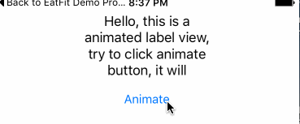

# Animated Label

### 提要

首先给出实现效果



这一个动画由两个部分组成：

1. 平移：将label从右到左做平移
2. 字体显示：文字逐渐显现

第一个动画很好实现，我们介绍第二个动画的实现。

### 动画实现

实现的思路就是利用`NSAttributedString`，将字符串分成两个部分：

1. 要显示的部分，颜色为字符串的正常颜色
2. 隐藏的部分，透明色的字符串

再利用`dispatch_after`递归的增加要显示的字符，这样一来就有了字符串逐渐显现的效果。

代码：

```Swift
private func iterateAlpha(text: NSString, index: Int, delay: Double, font: UIFont, color: UIColor) {
        let subStringToShow = text.substringToIndex(index)
        let subStringToHide = text.substringFromIndex(index)
        
        let showAttributes = [NSFontAttributeName : font, NSForegroundColorAttributeName : color]
        let hideAttrubutes = [NSFontAttributeName : font, NSForegroundColorAttributeName : UIColor.clearColor()]
        
        let showString = NSAttributedString(string: subStringToShow, attributes: showAttributes)
        let hideString = NSAttributedString(string: subStringToHide, attributes: hideAttrubutes)
        
        let resultString = NSMutableAttributedString()
        resultString.appendAttributedString(showString)
        resultString.appendAttributedString(hideString)
        
        self.attributedText = resultString
        
        if subStringToHide.characters.count != 0 {
            let time = dispatch_time(DISPATCH_TIME_NOW, Int64(delay * Double(NSEC_PER_SEC)))
            
            dispatch_after(time, dispatch_get_main_queue()) {
                self.iterateAlpha(text, index: index+1, delay: delay, font: font, color: color)
            }
        }
    }
```
