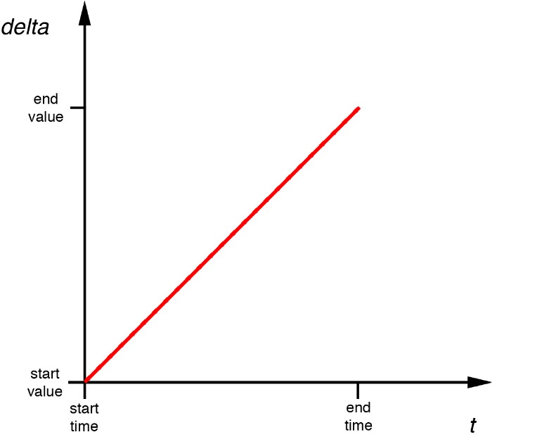
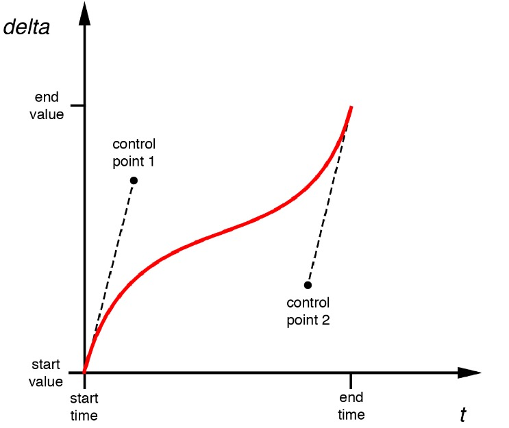

# RoundChart 

### 提要
效果图

其实实现并没有什么难点，主要利用了`UIBezierPath`，这里只是简要介绍一下`UIBezierPath`的控制点。

### UIBezierPath Control Points

用一个简单的图表来解释

横轴是时间，纵轴是偏移量，那么图中曲线的斜率就是速度。

一个三次贝赛尔曲线的图表：

一个三次贝赛尔曲线有四个控制点，其中两个默认为(0, 0)和(1, 1)，另外两个如图所示。这两个点像磁铁一样，把原本斜率为1的曲线往自身所在的位置吸引（计算公式不知道，这样理解其实能够解决大部分问题）。这样理解之后如果想要自己构造一个时间函数，只要取大概的两个控制点，然后不断实验即可。
