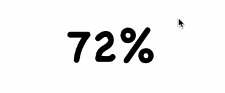

# Tween

### 提要

首先看效果：



主要的模块：

1. TweenLayer：用于动态修改数值
2. TweenLayerDelegate：修改Label的字符串
3. Tween：负责联合前两个模块

### TweenLayer

先看看TweenLayer的代码

```Swift
class TweenLayer: CALayer {
    @NSManaged private var animatableProperty : CGFloat
    
    private weak var tweenDelegate: TweenLayerDelegate?
    
    var from: CGFloat = 0
    var to: CGFloat = 0
    var tweenDuration: NSTimeInterval = 0
    var timingFunction = CAMediaTimingFunction(name: kCAMediaTimingFunctionLinear)
    var delay: NSTimeInterval = 0
    
    override class func needsDisplayForKey(event: String) -> Bool {
        return event == "animatableProperty" ? true : super.needsDisplayForKey(event)
    }
    
    override func actionForKey(event: String) -> CAAction? {
        if event != "animatableProperty" {
            return super.actionForKey(event)
        }
        
        let animation = CABasicAnimation(keyPath: event)
        animation.timingFunction = timingFunction
        animation.fromValue = from
        animation.toValue = to
        animation.duration = tweenDuration
        animation.delegate = self
        animation.beginTime = CACurrentMediaTime() + delay
        
        return animation
    }
    
    override func animationDidStop(anim: CAAnimation, finished flag: Bool) {
        tweenDelegate?.tweenLayerDidStopAnimation(self)
    }
    
    override func display() {
        if let value = presentationLayer()?.animatableProperty {
            tweenDelegate?.tweenLayer(self, didSetAnimatableProperty: value)
        }
    }
    
    func startAnimaton() -> Void {
        animatableProperty = to
    }
    
}
```

`@NSManaged`指定animatableProperty的值再runtime的时候动态生成。实际上这是利用Core Animation来动态生成一系列值。我们只要重写`actionForKey(even: String)`，指定当某一个`Tween`的property改变的时候的动画，即代码中的animation，那么Core Animation会自动为我们实现所需要的效果。

### TweenLayerDelegate

我们得到来一系列的数值，那么如何将其显示到Label上呢？这里我们用delegate的方式来实现。TweenLayerDelegate协议以及Tween的默认实现如下：

```Swift
protocol TweenLayerDelegate: class {
    func tweenLayer(layer: TweenLayer, didSetAnimatableProperty to: CGFloat) -> Void
    
    func tweenLayerDidStopAnimation(layer: TweenLayer) -> Void
}

extension Tween : TweenLayerDelegate {
    func tweenLayerDidStopAnimation(layer: TweenLayer) {
        layer.removeFromSuperlayer()
    }
    
    func tweenLayer(layer: TweenLayer, didSetAnimatableProperty to: CGFloat) {
        print("Current Value: \(to)")
        if let mapper = mapper {
            object.setValue(mapper(to), forKey: key)
        } else {
            object.setValue(to, forKey: key)
        }
    }
}
```

在`TweenLayer`那一节的代码中，有一个`display`方法

```Swift
override func display() {
     if let value = presentationLayer()?.animatableProperty {
         tweenDelegate?.tweenLayer(self, didSetAnimatableProperty: value)
     }
}
```

`display`再每一次layer需要重新显示的时候被调用，那么我们就可以取当前animatableProperty的值，调用代理的方法，这样就可以显示再label上来。

### Tween

Tween的代码还是比较简单易懂的，这里就不再做介绍，具体代码见工程源码。


